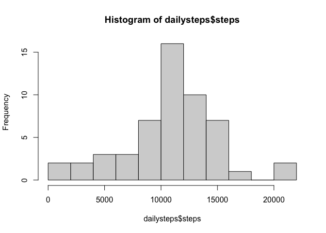
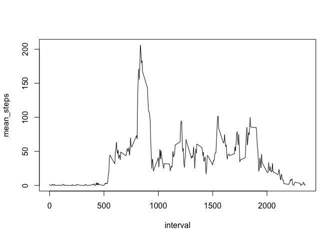
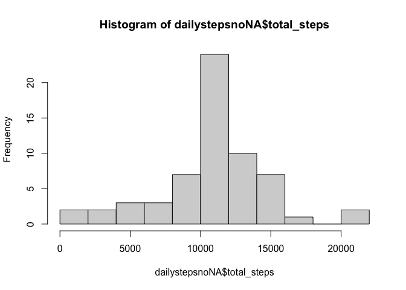
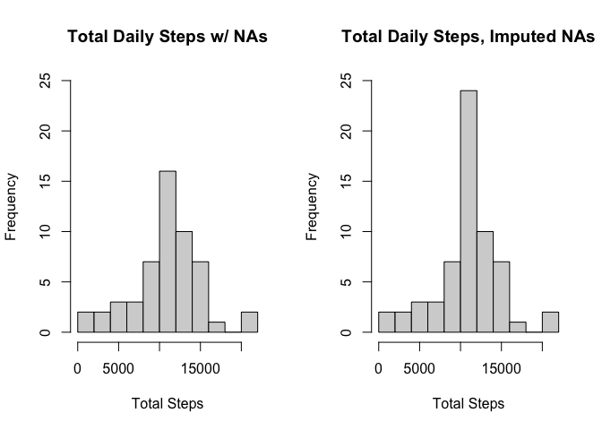
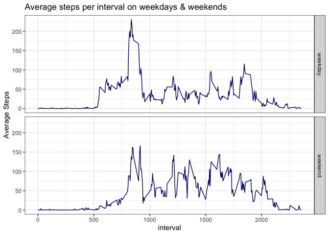

## Loading and preprocessing the data


```r
library(tidyverse)
```

```
## ── Attaching packages ────────────────────────────────────────────────────────────────────────────────────────────────────────────────── tidyverse 1.3.0 ──
```

```
## ✓ ggplot2 3.3.0     ✓ purrr   0.3.4
## ✓ tibble  3.0.1     ✓ dplyr   0.8.5
## ✓ tidyr   1.0.2     ✓ stringr 1.4.0
## ✓ readr   1.3.1     ✓ forcats 0.5.0
```

```
## ── Conflicts ───────────────────────────────────────────────────────────────────────────────────────────────────────────────────── tidyverse_conflicts() ──
## x dplyr::filter() masks stats::filter()
## x dplyr::lag()    masks stats::lag()
```

```r
library(lubridate)
```

```
## 
## Attaching package: 'lubridate'
```

```
## The following objects are masked from 'package:dplyr':
## 
##     intersect, setdiff, union
```

```
## The following objects are masked from 'package:base':
## 
##     date, intersect, setdiff, union
```


```r
activity <- read_csv("./activity.zip", col_names = TRUE)
```

```
## Parsed with column specification:
## cols(
##   steps = col_double(),
##   date = col_date(format = ""),
##   interval = col_double()
## )
```

## What is mean total number of steps taken per day?


```r
dailysteps <- activity %>% group_by(date) %>% summarize(steps = sum(steps))
dailysteps
```

```
## # A tibble: 61 x 2
##    date       steps
##    <date>     <dbl>
##  1 2012-10-01    NA
##  2 2012-10-02   126
##  3 2012-10-03 11352
##  4 2012-10-04 12116
##  5 2012-10-05 13294
##  6 2012-10-06 15420
##  7 2012-10-07 11015
##  8 2012-10-08    NA
##  9 2012-10-09 12811
## 10 2012-10-10  9900
## # … with 51 more rows
```

```r
hist(dailysteps$steps, breaks = 10)
```

<!-- -->


```r
mean(dailysteps$steps, na.rm = T)
```

```
## [1] 10766.19
```

```r
median(dailysteps$steps, na.rm = T)
```

```
## [1] 10765
```

## What is the average daily activity pattern?


```r
intsteps <- activity %>% group_by(interval) %>% summarise(mean_steps = mean(steps, na.rm = T))
intsteps
```

```
## # A tibble: 288 x 2
##    interval mean_steps
##       <dbl>      <dbl>
##  1        0     1.72  
##  2        5     0.340 
##  3       10     0.132 
##  4       15     0.151 
##  5       20     0.0755
##  6       25     2.09  
##  7       30     0.528 
##  8       35     0.868 
##  9       40     0     
## 10       45     1.47  
## # … with 278 more rows
```


```r
with(intsteps, plot(interval, mean_steps, type = "l"))
```

<!-- -->


```r
intsteps$interval[which.max(intsteps$mean_steps)]
```

```
## [1] 835
```

## Imputing missing values

How many rows in the data set have NAs?


```r
sum(is.na(activity))
```

```
## [1] 2304
```

Let's isolate those into a separate tibble and then join them with the tibble containing average steps by interval.


```r
actNA <- activity[is.na(activity$steps),]
NAjoin <- left_join(actNA, intsteps)
```

```
## Joining, by = "interval"
```

```r
head(NAjoin)
```

```
## # A tibble: 6 x 4
##   steps date       interval mean_steps
##   <dbl> <date>        <dbl>      <dbl>
## 1    NA 2012-10-01        0     1.72  
## 2    NA 2012-10-01        5     0.340 
## 3    NA 2012-10-01       10     0.132 
## 4    NA 2012-10-01       15     0.151 
## 5    NA 2012-10-01       20     0.0755
## 6    NA 2012-10-01       25     2.09
```

Now let's assign the mean steps per interval to their corresponding NA values in a new data set.


```r
activitynoNA <- activity
activitynoNA$steps[is.na(activitynoNA$steps)] <- NAjoin$mean_steps
mean(is.na(activitynoNA$steps))
```

```
## [1] 0
```

```r
head(activitynoNA)
```

```
## # A tibble: 6 x 3
##    steps date       interval
##    <dbl> <date>        <dbl>
## 1 1.72   2012-10-01        0
## 2 0.340  2012-10-01        5
## 3 0.132  2012-10-01       10
## 4 0.151  2012-10-01       15
## 5 0.0755 2012-10-01       20
## 6 2.09   2012-10-01       25
```


```r
dailystepsnoNA <- activitynoNA %>% group_by(date) %>% summarise(total_steps = sum(steps))
head(dailystepsnoNA, n = 10)
```

```
## # A tibble: 10 x 2
##    date       total_steps
##    <date>           <dbl>
##  1 2012-10-01      10766.
##  2 2012-10-02        126 
##  3 2012-10-03      11352 
##  4 2012-10-04      12116 
##  5 2012-10-05      13294 
##  6 2012-10-06      15420 
##  7 2012-10-07      11015 
##  8 2012-10-08      10766.
##  9 2012-10-09      12811 
## 10 2012-10-10       9900
```

Here's a histogram of the daily steps with the imputed NA values.


```r
hist(dailystepsnoNA$total_steps, breaks = 10)
```

<!-- -->

Let's plot the daily steps with NAs and with NA values imputed side by side to see the difference.


```r
par(mfrow = c(1,2))
hist(dailysteps$steps, breaks = 10, main = "Total Daily Steps w/ NAs", xlab = "Total Steps", ylim = c(0,25))
hist(dailystepsnoNA$total_steps, breaks = 10, main = "Total Daily Steps, Imputed NAs", xlab = "Total Steps", ylim = c(0,25))
```

<!-- -->

Now let's examine the means and medians of the imputed and original data sets.


```r
DailySum <- matrix(list("Imputed", "NAs", mean(dailystepsnoNA$total_steps), mean(dailysteps$steps, na.rm = T), median(dailystepsnoNA$total_steps), median(dailysteps$steps, na.rm = T)), 2, 3)
colnames(DailySum) <- c("Cat", "Mean", "Median")
DailySum
```

```
##      Cat       Mean     Median  
## [1,] "Imputed" 10766.19 10766.19
## [2,] "NAs"     10766.19 10765
```

It seems that imputing the NA values from the mean by interval changed the median to equal the mean value, but had no effect on the mean.

## Are there differences in activity patterns between weekdays and weekends?

First let's create a new factor variable indicating whether the observation occurred on a weekday or weekend.


```r
activitynoNA <- activitynoNA %>% mutate(DayClass = as.factor(ifelse(wday(ymd(date)) %in% c(1,7), "weekend", "weekday"))) %>% select(steps, date, interval, DayClass)
```

Now let's create a summary with the mean steps, grouped by weekday/weekend and interval.


```r
wdayIntervalSum <- activitynoNA %>% group_by(DayClass, interval) %>% summarise(mean_steps = mean(steps))
wdayIntervalSum
```

```
## # A tibble: 576 x 3
## # Groups:   DayClass [2]
##    DayClass interval mean_steps
##    <fct>       <dbl>      <dbl>
##  1 weekday         0     2.25  
##  2 weekday         5     0.445 
##  3 weekday        10     0.173 
##  4 weekday        15     0.198 
##  5 weekday        20     0.0990
##  6 weekday        25     1.59  
##  7 weekday        30     0.693 
##  8 weekday        35     1.14  
##  9 weekday        40     0     
## 10 weekday        45     1.80  
## # … with 566 more rows
```

Now let's create a panel plot using the summary tibble and ggplot2.


```r
g <- ggplot(data = wdayIntervalSum, aes(interval, mean_steps))
g + geom_line(color = "navy blue") + facet_grid(DayClass~.) + ylab("Average Steps") + ggtitle("Average steps per interval on weekdays & weekends") + theme_bw()
```

<!-- -->
